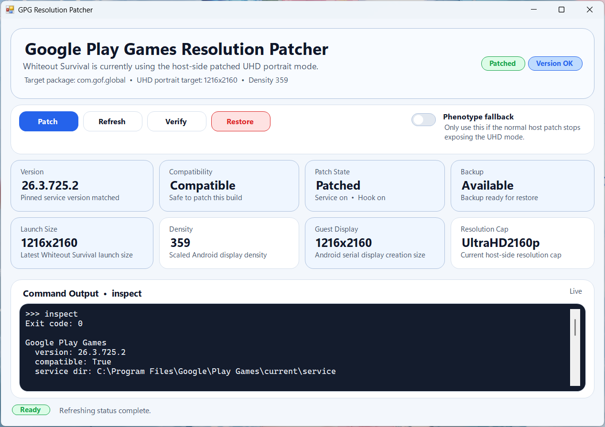

<p align="center">
  
</p>

<h1 align="center">GPG Patcher</h1>

---

<p align="center"><strong>Windows patcher for improving Whiteout Survival image clarity on Google Play Games for PC.</strong></p>

<p align="center">
  A small GUI app for inspecting, patching, verifying, and restoring the
  host-side resolution workaround for <code>com.gof.global</code>.
</p>

<p align="center">
  
  
  
  
</p>

<p align="center">
  <a href="#overview">Overview</a> ·
  <a href="#download">Download</a> ·
  <a href="#quick-start">Quick Start</a> ·
  <a href="#build-from-source">Build From Source</a> ·
  <a href="#warning">Warning</a>
</p>

<a id="warning"></a>

> [!WARNING]
> This is an unofficial third-party project and is not affiliated with Google, Google Play Games, or Whiteout Survival.  
> It targets a specific Google Play Games for PC build and cannot be guaranteed to work on every system.  
> `Patch` and `Restore` modify files under `C:\Program Files\Google\Play Games\current\service\`.  
> Future Google Play Games updates may break this tool at any time.  
> Use it at your own risk. No warranty is provided for breakage, data loss, compatibility issues, or any Google Play Games terms-of-service consequences.

## Overview

GPG Patcher is a desktop app for Google Play Games for PC systems where Whiteout Survival appears blurry at the stock launch size.
It applies a host-side patch for `com.gof.global`, targeting a 2160x3840 portrait launch, and keeps the full workflow in one place: inspect the current state, apply the patch, verify the result, and restore the original files if needed.

<p align="center">
  
</p>

## Download

Download the latest release archive from [GitHub Releases](https://github.com/MrDevFX/GPG-Patcher/releases/latest) and extract it to any writable folder.

## Quick Start

1. Launch `GPG Patcher.exe` from the extracted release folder.
2. Click `Refresh` to check the current patch state.
3. Click `Patch` and accept the Windows UAC prompt if it appears.
4. Launch Whiteout Survival from Google Play Games for PC.
5. Click `Verify` to confirm the higher-resolution launch.
6. Click `Restore` if you want to roll back to the original files.

## Build From Source

This project can be built from source on a Windows machine that already has Google Play Games for PC installed.

- Windows
- .NET SDK with .NET Framework 4.8 targeting support
- Google Play Games for PC installed locally
- `ServiceLib.dll`, `Ipc.Protos.dll`, and `Google.Protobuf.dll` available under `C:\Program Files\Google\Play Games\current\service\`

At runtime, GPG Patcher automatically checks whether the required internal target methods and signatures are present before enabling patch operations.

```powershell
dotnet build .\GPG-Patcher.slnx -c Release
powershell -ExecutionPolicy Bypass -File .\scripts\Build-Release.ps1
```

The GUI build output is written to `artifacts\app\Release\`, and release bundles are written to `artifacts\release\`.

## Supported Setup

| Item | Value |
| --- | --- |
| Platform | Windows |
| App | GPG Patcher GUI |
| Target game | Whiteout Survival (`com.gof.global`) |
| Target portrait mode | `2160x3840` |
| Compatibility rule | Required Google Play Games target methods and signatures detected automatically |
| Default service path | `C:\Program Files\Google\Play Games\current\service\` |
| Backup location | `%LocalAppData%\GpgPatcher\backup\<installed-version>\` |
